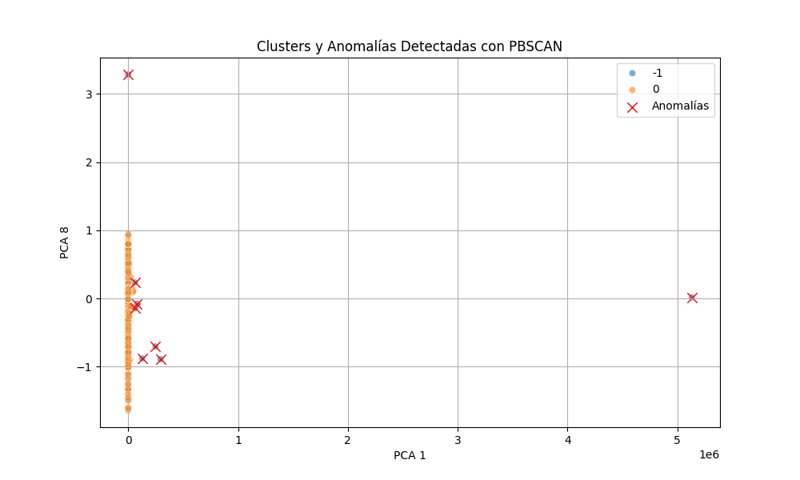

# 🚀 Network Anomaly Detection with PBSCAN & FastAPI  
🛡️ **Detección de Anomalías en Tráfico de Red usando PBSCAN y Machine Learning**  

> 💻 Un sistema avanzado basado en **DBSCAN**, **PCA** y **FastAPI** para detectar tráfico malicioso en tiempo real.  

---

## **📚 Descripción**  

🔍 Este proyecto implementa un **sistema inteligente** de detección de anomalías en tráfico de red utilizando **PBSCAN (DBSCAN optimizado)**.  

✔️ Permite preprocesar datos, reducir dimensiones con **PCA**, entrenar un modelo y hacer **predicciones en tiempo real** vía API.  

✔️ Basado en el dataset de **KDDCup99**, ampliamente usado en la seguridad informática para detectar intrusiones y ataques.  

### **Principales Características:**  

-✅ **Preprocesamiento avanzado de datos 📊 con RobustScaler.** .

-✅ **Reducción de dimensionalidad ⚡ con PCA.**  .

-✅ **Clusterización inteligente 🤖 con PBSCAN.** .

-✅ **Visualización de anomalías 🔎 en gráficos de dispersión.** .

-✅ **API en tiempo real 🌍 usando FastAPI..** .
  
---

## **📂 Estructura del Proyecto**  

```
📂 Network-Anomaly-Detection-PBSCAN
├── 📁 src
│   ├── 📄 main.py               # Script principal
│   ├── 📄 api.py                # API con FastAPI
│   ├── 📄 clustering.py         # Algoritmo PBSCAN
│   ├── 📄 data_preprocessing.py # Normalización y limpieza
│   ├── 📄 distancia.py          # Cálculo de epsilon óptimo
│   ├── 📄 anomaly_detection.py  # Visualización de anomalías
│   ├── 📄download_and_process.py  # Script para descarga y procesamiento de datos
│   ├── 📄analize_anomalies.py  # Script para descarga y procesamiento de datos
├── 📁 data                     # Dataset KDDCup
├── 📁 results                  # Gráficos y resultados
└── 📄 README.md                # Este archivo 😃
└── 📄 requirements.txt         # Dependencias y librerias del proyecto

```

---

### 📌 **Tecnologías utilizadas:** 
- 🐍 **Python 3.9+**
- ⚡ **FastAPI** (Para detección en tiempo real)
- 📊 **Pandas, NumPy** (Manejo de datos)
- 🎨 **Seaborn, Matplotlib** (Visualización de anomalías)
- 🧠 **Scikit-learn** (PCA, DBSCAN)
- 🔍 **PBSCAN (DBSCAN optimizado para detección de anomalías)**

---

## **⚙️ Instalación y Configuración**  

### **1️⃣ Clonar el Repositorio**  
```bash
git clone https://github.com/tuusuario/Network-Anomaly-Detection-PBSCAN.git
cd Network-Anomaly-Detection-PBSCAN
```

### **2️⃣ Crear un Entorno Virtual y Activarlo**  
```bash
python -m venv venv
# En Windows:
venv\Scripts\activate
# En macOS/Linux:
source venv/bin/activate
```

### **3️⃣ Instalar Dependencias**  
```bash
pip install -r requirements.txt
```

---

## ⚙️ **Pipeline de Detección de Anomalías**

### 1️⃣   **Descarga y Procesamiento de Datos** 📥

- download_and_process.py permite descargar y preparar los datos automáticamente.
- Convierte datos crudos en un formato limpio y estructurado para el modelo.

### 2️⃣ **Carga y Preprocesamiento de Datos** 📊

- Se carga el dataset `KDDCup`.
- Se seleccionan las **variables más relevantes**.
- Se normalizan los datos con `RobustScaler` para manejar valores extremos.

### 3️⃣ **Cálculo del ****`eps`**** para PBSCAN** 🔢

- Se usa `NearestNeighbors` para calcular la distancia al **4º vecino más cercano**.
- Se usa la fórmula:
  ```python
  optimal_eps = mediana(distancias) + (0.5 * desviación_estándar)
  ```
- Esto permite encontrar un **umbral óptimo** para separar tráfico normal de anomalías.

### 4️⃣ **Aplicación de PBSCAN** 🤖

- Se usa `DBSCAN` con `eps=optimal_eps` y `min_samples` dinámico.
- Los puntos con **etiqueta ****`-1`** son considerados anomalías.
- Se calculan centroides de los clusters para filtrar **falsos positivos**.


### 5️⃣ **Visualización y Reportes** 📈

- Se generan **gráficos de dispersión** mostrando anomalías.
- Se usa **Seaborn** para analizar correlaciones en los datos.
- Se exportan **reportes en CSV** con detalles de las anomalías detectadas.

---

## 🚀 **Ejecución del Proyecto**

### 🔹 **Ejecutar el análisis de tráfico (modo local)**

```bash
python src/main.py
```

### 🔹 **Levantar la API en tiempo real** 🌍

```bash
uvicorn src.api:app --reload
```

📌 Luego accede a:

- **Interfaz de prueba de la API** 👉 `http://127.0.0.1:8000/docs`
- **Endpoint principal** 👉 `http://127.0.0.1:8000`

### 🔹 **Hacer una predicción con la API** 📡

```bash
curl -X 'POST' 'http://127.0.0.1:8000/predecir' \
-H 'Content-Type: application/json' \
-d '{
  "duration": 10.5,
  "src_bytes": 500,
  "dst_bytes": 3000,
  "count": 50,
  "srv_count": 10,
  "dst_host_count": 5,
  "dst_host_same_srv_rate": 0.8,
  "same_srv_rate": 0.7
}'
```

📌 **Si es una anomalía**, la respuesta será:

```json
{
  "anomalía": true,
  "cluster": -1
}
```
## 📊 **Ejemplo de Visualización de Resultados** ##

📌 Aquí se pueden ver las anomalías resaltadas en rojo, indicando tráfico inusual.




---

## 🔥 **Insights Clave del Análisis de Anomalías**
A partir del análisis de anomalías y la **matriz de correlación**, encontramos patrones clave que refuerzan la detección de actividad sospechosa en la red.

---

# 🔍 1️⃣ `dst_bytes` es la variable más impactada en anomalías (Diferencia: +1026.59)

 📌 **Hallazgo:**
- `dst_bytes` es la variable con **mayor diferencia** entre datos normales y anomalías.
- **En la matriz de correlación**, `dst_bytes` tiene **correlaciones negativas con otras variables**, como `dst_host_count` (-0.78) y `src_bytes` (-0.53).

 ✅ **Interpretación:**
- **Correlación negativa con `dst_host_count` (-0.78):**
    - Cuando `dst_bytes` es alto, el número de hosts de destino tiende a ser menor.
    - Esto sugiere **ataques dirigidos a pocos servidores específicos con tráfico masivo** (posible exfiltración de datos o DDoS selectivo).
- **Correlación negativa con `src_bytes` (-0.53):**
    - Cuando los bytes enviados (`src_bytes`) son altos, los bytes recibidos (`dst_bytes`) tienden a ser bajos.
    - **Posible indicio de escaneo de red**: muchas solicitudes salientes con pocas respuestas grandes.

# 🛠 **Recomendaciones:**
- **Monitorear tráfico de salida en servidores con alto `dst_bytes` y bajo `src_bytes`.**
- **Investigar tráfico dirigido a pocos hosts con alta transferencia de datos** para detectar ataques de extracción de información.

---

# 🔍 2️⃣ `dst_host_count` sugiere ataques dirigidos (Diferencia: +66.09)

 📌 **Hallazgo:**
- `dst_host_count` representa **el número de hosts con los que se comunica una IP**.
- **En la matriz de correlación**, `dst_host_count` tiene una **correlación negativa con `dst_bytes`**.

 ✅ **Interpretación:**
- **Posible escaneo de red selectivo:**
    - Si un atacante explora varios hosts (`dst_host_count` alto) pero sin enviar muchos datos (`dst_bytes` bajo), es posible que esté buscando vulnerabilidades en múltiples servidores sin realizar ataques activos.
- **Posible ataque DDoS focalizado:**
    - Si `dst_host_count` es alto y `dst_bytes` también, podría indicar un botnet atacando múltiples hosts con alto volumen de tráfico.

 🛠 **Recomendaciones:**
- **Detectar IPs con `dst_host_count` inusualmente alto y revisar qué tipo de tráfico están enviando.**
- **Comparar si estos patrones aparecen en picos de actividad sospechosos.**

---

# 🔍 3️⃣ `duration` es mucho mayor en anomalías (+47.98 seg.)

 📌 **Hallazgo:**
- En anomalías, la duración de conexión es **significativamente más larga** que en el tráfico normal.
- **En la matriz de correlación, `duration` no tiene correlaciones fuertes con otras variables**, lo que sugiere que **las conexiones anómalas son independientes de otras métricas de tráfico**.

 ✅ **Interpretación:**
- **Conexiones persistentes pueden ser tráfico malicioso oculto**:
    - Una sesión larga podría indicar **una máquina infectada comunicándose con un C2 (Command & Control)** en un ataque de malware.
    - También podría indicar **transferencias de datos grandes y lentas** para evadir detección de DLP (Data Loss Prevention).

🛠 **Recomendaciones:**
- **Monitorizar conexiones de larga duración en servidores sensibles.**
- **Relacionar duración con volumen de datos (`dst_bytes` y `src_bytes`) para ver si hay tráfico sospechoso.**

---

# 🔍 4️⃣ `src_bytes` tiene un comportamiento anómalo en anomalías (+2.60)

 📌 **Hallazgo:**
- `src_bytes` muestra un aumento en anomalías, pero su correlación con `count` en la matriz de correlación es extremadamente alta (0.99).

 ✅ **Interpretación:**
- **Escaneo de red con muchas solicitudes y pocas respuestas:**
    - La correlación fuerte entre `src_bytes` y `count` indica que los hosts anómalos **generan muchas conexiones enviando datos pequeños**.
    - Este patrón es característico de:
        - **Ataques de fuerza bruta** (muchas solicitudes a diferentes servicios).
        - **Bots probando credenciales en múltiples hosts**.

 🛠 **Recomendaciones:**
- **Detectar IPs con tráfico saliente alto (`src_bytes`) y muchas conexiones (`count`).**
- **Cruzar estos datos con logs de acceso para ver si coinciden con intentos de autenticación fallidos.**

---

# 🔍 5️⃣ `count` alto en anomalías sugiere actividad automatizada (+0.51)

 📌 **Hallazgo:**
- `count` indica la cantidad de conexiones activas.
- En anomalías, tiene un **valor más alto que en datos normales** y una correlación fuerte con `src_bytes` (0.99).

 ✅ **Interpretación:**
- **Alta actividad en anomalías con muchas conexiones concurrentes** sugiere:
    - **Fuerza bruta en autenticación** (si coincide con tráfico HTTP o SSH).
    - **Escaneo agresivo de red** para mapear hosts activos.
    - **Actividad de bots** intentando conectarse repetidamente a servicios específicos.

 🛠 **Recomendaciones:**
- **Bloquear IPs que generen un número inusual de conexiones en poco tiempo.**
- **Monitorear logs de autenticación para detectar accesos repetidos desde las mismas IPs.**

---

# 📌 Conclusión General con Matriz de Correlación

### ✅ **Patrón Detectado:**
1. **Ataques de exfiltración de datos:** `dst_bytes` elevado en pocos hosts.
2. **Escaneos de red o bots:** `src_bytes` y `count` correlacionados en anomalías.
3. **Persistencia sospechosa:** Conexiones largas (`duration`) con alta transferencia de datos.
4. **Ataques dirigidos:** `dst_host_count` alto con `dst_bytes` bajo.

### ✅ **Siguientes pasos recomendados:**
- **Generar alertas para estas anomalías.**
- **Relacionar estos patrones con logs de red (IPs, puertos, protocolos).**
- **Optimizar el modelo de detección con estas métricas para reducir falsos positivos.**


---

## 🛠 **Mejoras Futuras**
✅ **Integración con SIEM (Security Information and Event Management)** para detección en tiempo real.  
✅ **Notificaciones automáticas a administradores vía correo o Telegram** en caso de detección de ataques.  
✅ **Entrenamiento de modelos de Machine Learning supervisados para mejorar la precisión** de la detección de anomalías.

---

## ✨ **Autores y Contribución**
Este proyecto fue desarrollado por 🧑‍💻 **Ilyd Bautista**. ¡Las contribuciones son bienvenidas! Si deseas mejorar este sistema de detección, crea un **Pull Request** o abre un **Issue** en el repositorio. 💡

📬 **Contacto:** [bautistaosta1@gmail.com](mailto:bautistaosta1@gmail.com)

🌟 **Si te gustó este proyecto, dale una estrella ⭐ en GitHub!**
